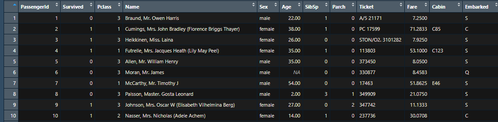
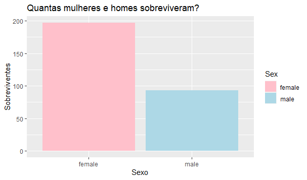
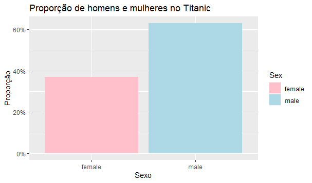
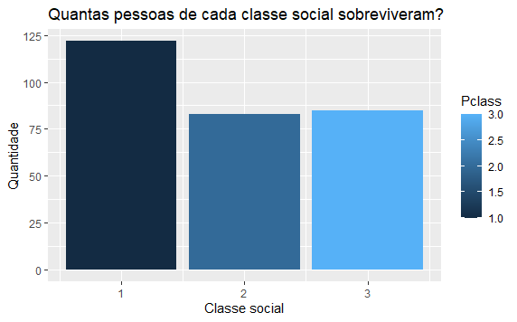
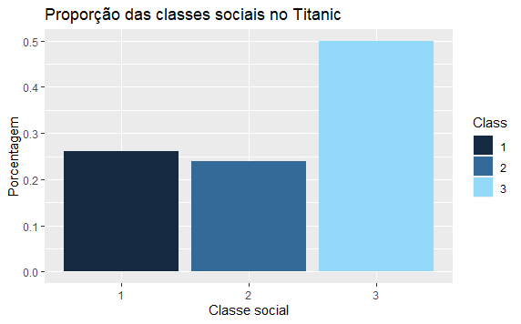
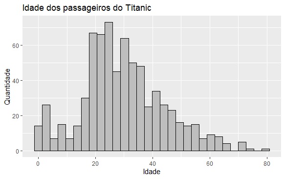
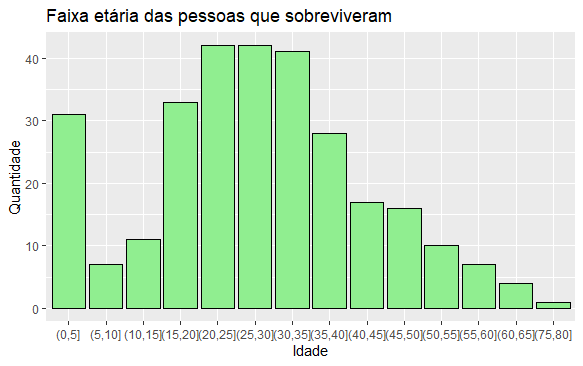
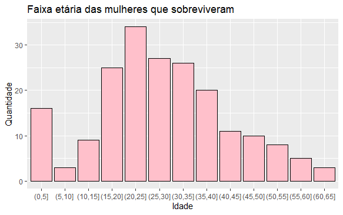
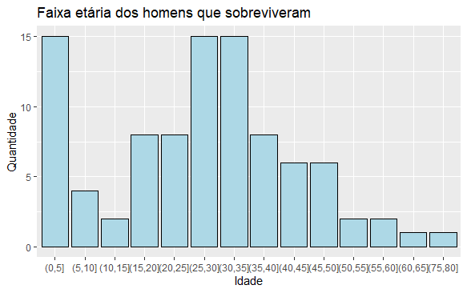

# Análise Exploratória de Dados (EDA) - Titanic

## Dataset

O dataset utilizado foi do Titanic retirado do Kaggle: <https://www.kaggle.com/competitions/titanic>.

O conjunto de dados possue 12 variáveis:

-   **PassengerId**: Código identificador de cada passageiro que estava no navio.

-   **Survived**: Se o passageiro sobreviveu ou não. Se sobreviveu = 1, caso contrário = 0.

-   **PClass**: Classe do ticket. 1° classe = 1, 2° classe = 2 e 3° classe = 3.

-   **Name**: Nome completo do passageiro que estava no navio.

-   **Sex**: Sexo biológico. Masculino = male, Feminino = female.

-   **SibSp**: Número de irmãos ou conjugês no navio.

-   **Parch**: Número de pais ou crianças no navio.

-   **Ticket**: Número do ticket.

-   **Fare**: Preço da passagem em libras esterlinas (GBP). Naquela época 1 libra esterlina equivalia a 18,5 réis e atualmente, 1 libra esterlina equivale a 6,15 reais.

-   **Cabin**: Número da cabine que o passageiro estava hospedado.

-   **Embarked**: Portão de embarque. C = Cherbourg, Q = Queenstown, S = Southampton

-   **Age**: idade em anos inteiros.

    ### Preview dos dados

    {width="551" height="131"}

## Preparação dos dados

Primeiramente, é necessário escolher o diretório de trabalho que o dataset será encontrado.

```{r}
setwd("c:\\titanic")
df_titanic <- read.csv("titanic.csv")
View(df_titanic)
```

## Limpeza dos dados

A segunda etapa será efetuar a limpeza dos dados.

Primeiro será necessário excluir 4 colunas que não serão úteis:

-   PassengerId

-   Name

-   Ticket

-   Cabin

    df_titanic \<- subset(df_titanic, select = c(-PassengerId, -Name, -Ticket, -Cabin)) View(df_titanic)

Após, será necessário excluir todas as linhas que possuem, pelo menos, um valor nulo ou NA.

```{r}
setwd("C:\\titanic")
df_titanic <- df_titanic[complete.cases(df_titanic), ]
View(df_titanic)
```

## Visualização dos dados

### Quantas pessoas de cada sexo sobreviveram?



```{r}
  ggplot(data = df_titanic, aes(x=Sex, y=Survived, fill=Sex)) +
    geom_col() +
    labs(x="Sexo", y = "Sobreviventes", title="Quantas mulheres e homes sobreviveram?") +
    scale_fill_manual(values=c("pink","light blue"))
```

#### Qual a proporção de cada gênero?



```{r}
#Tabela de proporções de homens e mulheres
sex_table <- round(prop.table(table(df_titanic$Sex)),2)

#tabela para dataframe
df_sex <- data.frame(Sex = rownames(sex_table), Proportion = as.numeric(sex_table))

# gráfico
ggplot(df_sex, aes(x = Sex, y = Proportion, fill = Sex)) +
  geom_bar(stat = "identity") +
  scale_y_continuous(labels = scales::percent_format()) +
  labs(title = "Proporção de homens e mulheres no Titanic",
       x = "Sexo", y = "Proporção")
```

É possível perceber que mais mulheres sobreviveram do que homens, mesmo com a quantidade de homens a bordo do navio tenha sido maior do que a de mulheres.

Um dos motivos desse acontecimento é que um dos códigos de condutas da marinha muito comum naquela época era dar prioridade nos barcos salva-vidas para as mulheres e crianças.

### Quantas pessoas de cada classe social sobreviveram?



```{r}
ggplot(df_titanic, aes(x = Pclass, y = Survived, fill = Pclass)) +
  geom_bar(stat = "identity") +
  labs(title = "Quantas pessoas de cada classe social sobreviveram?",
       x = "Classe social", y = "Quantidade")
```

#### Qual a proporção de cada classe social?



```{r}
#Proporção de pessoas em cada classe social  no dataset
class_table <- round(prop.table(table(df_titanic$Pclass)),2)

#tabela para dataframe
df_class <- data.frame(Class = rownames(class_table), Proportion = as.numeric(class_table))

# gráfico
ggplot(df_class, aes(x = Class, y = Proportion, fill = Class)) +
  geom_bar(stat = "identity") +
  labs(title = "Proporção das classes sociais no Titanic",
       x = "Classe social", y = "Porcentagem") +
  scale_fill_manual(values=c("#152940", "#336a98", "#92d9fa"))
```

É possível perceber que mais pessoas da classe social mais alta sobreviveram mesmo tendo menos gente a bordo do navio. Existem alguns possíveis motivos para isso:

1.  **Prioridade:** As pessoas da primeira classe eram os primeiros a entrar no navio, assim como os primeiros a entrarem no bote salva-vidas.

2.  **Proximidade dos barcos salva-vidas:** As cabines dos passageiros da primeira classe estavam em uma localização mais próxima dos bote salva-vidas.

3.  **Normal sociais:** Além das crianças e das mulheres terem prioridades em serem salvas. É importante ressaltar que pessoas mais influentes eram priorizadas na hora dos salvamentos.

    ## Qual era a idade dos passageiros que estavam no Titanic?

```{r}
ggplot(data = df_titanic, aes(x = Age)) +
  geom_histogram(fill = "gray", color = "black") +
  labs(title = "Idade dos passageiros do Titanic", x = "Idade", y = "Quantidade")
```

É possível observar que a grande parte das pessoas que estavam no Titanic eram de 20 até 38 anos e tinham poucas pessoas com mais de 50 anos.



```{r}
df_survived <- subset(df_titanic, Survived == 1)

ggplot(data = df_survived, aes(x = age_group)) +
  geom_bar(fill = "light green", color = "black") +
  labs(title = "Faixa etária das pessoas que sobreviveram", 
       x = "Idade", y = "Quantidade") 
```

É perceptível que a faixa etária predominante (20-35 anos) foi a que mais sobreviveu. Assim como grande parte das crianças de 0 até 5 anos, nesse caso pode ter alguma relação com terem pais a bordo.

### Quantas mulheres sobreviveram?



```{r}
df_survived_female <- subset(df_titanic, Survived == 1 & Sex == "female")

ggplot(data = df_survived_female, aes(x = age_group)) +
  geom_bar(fill = "pink", color = "black") +
  labs(title = "Faixa etária das mulheres que sobreviveram", 
       x = "Idade", y = "Quantidade") 
```

É possível perceber que a maior parte das mulheres que sobreviveram foram as que tinham de 20 até 25 anos. Considerando o gráfico das pessoas que sobreviveram, independente do sexo, é possível perceber que praticamente todos os passageiros dessa faixa etária eram mulheres.

### Quantos homens sobreviveram?



```{r}
df_survived_male <- subset(df_titanic, Survived == 1 & Sex == "male")

ggplot(data = df_survived_male, aes(x = age_group)) +
  geom_bar(fill = "light blue", color = "black") +
  labs(title = "Faixa etária dos homens que sobreviveram", 
       x = "Idade", y = "Quantidade") 
```

No caso dos homens, os homens entre 0 até 5 anos, 25 até 35 anos todos sobreviveram. Justamente a faixa etária predominante no navio. Também é possível que eles tenham relação com terem conjugês a bordo.
